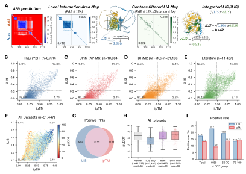

# AFM-LIS: Local Interaction Score for Structure Predictions

This repository provides tools to calculate the Local Interaction Score (LIS) from structure prediction outputs for enhanced protein-protein interaction (PPI) discovery. The LIS framework accurately identifies transient and flexible interactions (e.g., involving SLiMs or IDRs) that global confidence metrics like ipTM often miss.

**Supports:** AlphaFold3, ColabFold/AlphaFold-Multimer, Boltz, Chai-1, OpenFold3

The framework includes two validated approaches:
- **iLIS (integrated Local Interaction Score)**: Our newest, robust **single metric** that combines interface confidence with a direct physical contact filter. This is the recommended score for most analyses. ([Kim et al., 2026](https://doi.org/10.64898/2026.04.14.718529))
- **LIS + LIA (Local Interaction Score + Area)**: Our original dual-metric system that evaluates interactions by assessing both the _score_ (LIS) and the _area_ (LIA) of the predicted interface. ([Kim et al., 2024](https://www.biorxiv.org/content/10.1101/2024.02.19.580970v1))


## How iLIS Works: The Core Concept

The iLIS framework identifies the high-confidence local interface, filters it for direct physical contacts, and combines these scores into a single, robust metric.


**Schematic of the iLIS calculation and benchmark data**.



> **Figure 1** from [Kim et al., 2026](https://doi.org/10.64898/2026.04.14.718529). **(A)** iLIS calculation scheme: the Local Interaction Area (LIA) Map is filtered by direct contacts (cLIA Map), and LIS and cLIS are combined as iLIS = √(LIS × cLIS). **(B–I)** iLIS effectively identifies positive interactions across multiple *Drosophila* PPI datasets (FlyBI Y2H, DPiM AP-MS, DPiM2 AP-MS, Literature), and is particularly informative for flexible protein complexes (low pLDDT groups).


## The Evolution from LIS to iLIS
### 1. The Original Framework: LIS + LIA ###

Standard AlphaFold metrics (like ipTM) often fail on flexible interactions because non-interacting disordered regions can "dilute" the global score. Our original **Local Interaction Score (LIS)** was developed to solve this by focusing only on the confidently predicted interface, defined as all residue pairs with a Predicted Aligned Error (PAE) **≤ 12 Å**.

However, `LIS` _by itself_ had a potential failure mode: it could assign a high score to a few residue pairs that were confidently predicted but physically distant and not in actual contact. Our original (2024) framework addressed this by using `LIS` in combination with a second metric, the **Local Interaction Area (LIA)**, which measures the area in the confident interface (PAE ≤ 12 Å). In the failure case, the `LIA` score would be tiny, successfully filtering out the false positive. This dual-metric `LIS + LIA system` remains a valid approach.


> **Examples of positive PPIs with flexible regions (decent LIS & LIA & low ipTM).** All PPI examples were _experimentally_ proven previously.


### 2. The New Metric: iLIS (integrated LIS) ###

The new **iLIS** metric streamlines this process into a single, more robust score. It was designed to solve the same problem by directly integrating a physical contact filter.

iLIS is calculated as the geometric mean of two components:
- **LIS (Local Interaction Score)**: The same as the original metric; measures the average confidence of the broad LIA (PAE ≤ 12 Å).
- **cLIS (contact-filtered LIS)**: A stricter metric that measures the average confidence only for residue pairs that are in direct physical contact (PAE ≤ 12 Å **AND** Cβ–Cβ distance ≤ 8 Å).

The final score is:

`iLIS = sqrt(LIS * cLIS)`

This use of a geometric mean is critical. If no direct physical contacts are confidently predicted (`cLIS = 0`), the final `iLIS` score is forced to zero, robustly eliminating this class of false positives. It now allows single metrics to distinguish positive and negative predictions.


> **Examples of positive PPIs with flexible regions (decent iLIS & low ipTM).** All PPI examples were _experimentally_ proven previously.


## Interpreting Results & Thresholds

We provide two validated frameworks for analysis. **iLIS is the recommended single-metric approach**.

### 1. Recommended: iLIS Framework (Kim et al., 2026) ###

A high-confidence interaction is suggested if:

- **iLIS ≥ 0.223**

This threshold was established using large-scale Y2H reference sets used in yeast (Yu et al., 2008), fly (Tang et al., 2023), and human (Braun et al., 2009). Please see the details in [Kim et al., 2026](https://doi.org/10.64898/2026.04.14.718529).

### 2. Original: LIS + LIA Framework (Kim et al., 2024) ###

A positive PPI is suggested if either of the following conditions is met:

- **Best LIS** ≥ 0.203 **AND** **Best LIA** ≥ 3432, or

- **Average LIS** ≥ 0.073 **AND** **Average LIA** ≥ 1610.

These cutoffs were derived from specific fly (Tang et al., 2023) and human (Braun et al., 2009) reference sets. As always, optimal thresholds may vary by dataset, and experimental validation is highly recommended.


## Usage

### Command-Line Tool: `lis.py` (Recommended for batch analysis)

A Python script for calculating LIS metrics from structure prediction outputs.

```bash
# Basic usage — auto-detects platform, processes all models
python lis.py /path/to/prediction_folder/

# Process a zip file
python lis.py alphafold3_output.zip

# Parallel processing with 4 CPUs
python lis.py /path/to/predictions/ -w 4

# Custom output location
python lis.py /path/to/predictions/ -d /path/to/output/

# Show error details for failed predictions
python lis.py /path/to/predictions/ -v

# Reprocess all (ignore existing results)
python lis.py /path/to/predictions/ --no-skip-existing
```

**Features:**
- Auto-detects prediction platform from filenames
- Handles `.gz` and `.xz` compressed files transparently
- Incremental CSV output — safe to interrupt and resume
- Progress bar with elapsed time and ETA
- Parallel processing with `--workers`
- Output sorted by name and rank

**Supported platforms (auto-detected):** AlphaFold3 (including the official *local* output and the AF3 Server layout), ColabFold, Boltz-1/2, Chai-1, OpenFold3.

**Unrecognized layout? Declare it with a manifest.** For anything auto-detection can't place, drop a `lis.json` in the folder (or pass `--manifest path/to/lis.json`) describing your data. All fields optional:

- `structure` / `pae` / `summary` — filename globs for the structure, PAE, and scores files
- `pae_key` — the JSON key holding the PAE matrix (when it isn't a standard one)
- `platform` — force a specific finder (same as `--platform`)
- `models` — an explicit `[{name, structure, pae, summary}]` list, for full control

```json
{"structure": "*_model.cif", "pae": "*_confidences.json", "pae_key": "pae"}
```

The manifest is checked before auto-detection; with `models` or `pae` it drives parsing directly, with only `platform` it just forces the finder. When a folder has no readable PAE, the error message points here.

### Web Tool: LIVIA

For visual analysis with no installation required:
- **[LIVIA](https://flyark.github.io/LIVIA/)** (**L**ocal **I**nteraction **VI**sualization and **A**nalysis) — drag & drop prediction files, view PAE/LIS/cLIS maps, generate ChimeraX/PyMOL scripts
- Supports all platforms listed above
- All analysis runs locally in your browser — no data leaves your device
- [Step-by-step tutorial](https://flyark.github.io/LIVIA/tutorials.html) · [GitHub](https://github.com/flyark/LIVIA)

### Batch Visualization: `lis_to_cxc.py` (ChimeraX scripts from `lis.py` output)

For large screens, generate per-fold ChimeraX `.cxc` scripts directly from a `lis.py` CSV — no web tool needed.

```bash
# 1. Score a prediction
python lis.py prediction.zip -o results_lis_analysis.csv

# 2. Generate ChimeraX visualizations
python lis_to_cxc.py \
    --csv results_lis_analysis.csv \
    --pdb-root . \
    --out cxc/

# 3. Open any cxc in ChimeraX (double-click)
```

Each `.cxc` opens the predicted structure in ChimeraX with:
- **LIR** residues colored in a light shade (per-chain palette)
- **cLIR** residues colored in the full shade
- A 2D label panel showing iLIS, cLIS, ranks, and LIR residues per chain (aggregated boundary)

Common flags: `--ilis-cutoff` (default `0.223`), `--top-n`, `--pairs A,B`, `--pairs-file`, `--metadata`, `--plddt`, `--palette`. Full help: `python lis_to_cxc.py --help`.

**Tip — figure generation for papers/slides.** After opening a `.cxc` in ChimeraX and orienting the view, save a transparent-background PNG with:

```
save myfigure.png transparentBackground true
```

The same command is included as a commented suggestion at the bottom of every emitted `.cxc` file.


## Output CSV Columns

| Column | Description |
|--------|-------------|
| name | Prediction name |
| rank | Rank number |
| model | Model number |
| iLIS | integrated LIS = √(LIS × cLIS) |
| iLIA | integrated LIA = √(LIA × cLIA) |
| iLISA | iLIS × iLIA |
| ipSAE | interaction prediction Score from Aligned Errors ([Dunbrack, 2025](https://www.biorxiv.org/content/10.1101/2025.02.10.637595)) |
| LIS | Local Interaction Score (PAE ≤ 12Å) |
| cLIS | contact-filtered LIS (PAE ≤ 12Å & Cβ ≤ 8Å) |
| LIA | Local Interaction Area (count of confident residue pairs) |
| cLIA | contact-filtered LIA |
| ipTM | interface predicted TM-score ([Evans et al., 2021](https://doi.org/10.1101/2021.10.04.463034)) |
| pLDDT_i/j | per-chain average pLDDT |
| pTM | predicted TM-score |
| LIR_i/j | count of Local Interaction Residues per chain |
| cLIR_i/j | count of contact-filtered LIR per chain |
| LIpLDDT_i/j | average pLDDT of LIR residues per chain |
| cLIpLDDT_i/j | average pLDDT of cLIR residues per chain |
| len_i/j | chain lengths |
| LIR_indices_i/j | LIR residue positions (compact range format) |
| cLIR_indices_i/j | cLIR residue positions (compact range format) |
| structure_file | source structure filename |


## Requirements

For `lis.py`:
- Python ≥ 3.8
- NumPy
- SciPy


## How to Cite

If you use this work, please cite the relevant paper:
- **For the iLIS metric (Recommended)**: Kim et al (2026). FlyPredictome: a structural atlas of predicted protein-protein interactions in _Drosophila_. _bioRxiv_ ([link](https://doi.org/10.64898/2026.04.14.718529))
- **For the original LIS + LIA framework**: Kim et al (2024). Enhanced Protein-Protein Interaction Discovery via AlphaFold-Multimer. _bioRxiv_ ([link](https://www.biorxiv.org/content/10.1101/2024.02.19.580970v1))


## FlyPredictome

Large-scale AlphaFold-Multimer PPI predictions in *Drosophila*, scored with the LIS framework:
- **[www.flyrnai.org/tools/fly_predictome/web/](https://www.flyrnai.org/tools/fly_predictome/web/)**
- Now covers **>1.5 million** PPI predictions.


## Declaration of Generative AI Usage

This project utilized OpenAI's ChatGPT, Google's Gemini, and Anthropic's Claude to assist in generating Python code, documentation, or other textual content.
